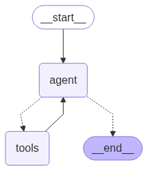

# Article Chat Assignment

An intelligent article chat system that enables users to interact with a predefined set of articles through natural language queries. The system can provide summaries, extract key topics, analyze sentiment, and compare multiple articles using an LLM agent with access to a vector database.

## 🏗️ Architecture Overview

The system implements an **LLM Agent-based architecture** designed to answer questions from a curated article database:

### Core Components

1. **Article Initialization & Processing Pipeline**
   - At startup, the system processes 17 articles from the assignment requirements
   - Each article goes through: Content extraction → LLM summarization → Embedding generation → ChromaDB storage
   - Metadata extracted by LLM includes: title, summary, keywords, sentiment, entities, and topics

2. **ReAct Agent with LangGraph**
   - Uses LangGraph framework to create a **ReAct (Reasoning + Acting) agent**
   - Agent receives a set of tools and for each user query:
     - Analyzes what tools are needed
     - Uses relevant tools iteratively
     - Continues until it has sufficient information to provide a complete answer

   **Agent Workflow Visualization:**
   
   
   
   The graph above shows the complete agent decision flow from initial query to final response.

3. **Tool-based Database Interaction**
   - Large toolkit that communicates with ChromaDB for semantic search
   - Tools include: article search, similarity matching, metadata filtering, and content retrieval
   - Enables the agent to find and analyze relevant articles for any user query

### Data Flow
```
Article URLs → Content Extraction → LLM Processing → Embeddings → ChromaDB
                                                                      ↓
User Query → ReAct Agent → Tools Selection → Database Search → AI Response
```

### Key Design Decisions

1. **ReAct Agent Pattern**: Chosen for its ability to iteratively reason and act, allowing complex multi-step queries
2. **ChromaDB Vector Store**: Provides fast semantic search capabilities for finding relevant articles
3. **LLM-Enhanced Metadata**: Each article is pre-processed with AI to extract rich metadata for better search
4. **Tool-based Architecture**: Modular design allows easy extension of capabilities
5. **Docker Containerization**: Ensures consistent deployment across environments

### Technologies Used
- **FastAPI**: REST API framework with automatic documentation
- **LangGraph**: Agent orchestration and workflow management
- **ChromaDB**: Vector database for semantic search
- **Google Gemini**: LLM for content processing and chat responses
- **Docker**: Containerization for easy deployment

## � Quick Start

### Prerequisites
- Docker and Docker Compose installed
- Google API Key for Gemini AI

### Simple Setup (Recommended)

1. **Clone and navigate to the project**
   ```bash
   git clone <repository-url>
   cd Article_Chat_Assignment
   ```

2. **Set your Google API key**
   ```bash
   # On Windows PowerShell:
   $env:GOOGLE_API_KEY="your-google-api-key-here"
   
   # On Linux/Mac:
   export GOOGLE_API_KEY="your-google-api-key-here"
   ```

3. **Start the system with Docker**
   ```bash
   docker-compose up --build -d
   ```

4. **Access the application**
   - **Web Interface**: http://localhost:8000
   - **API Documentation**: http://localhost:8000/docs

That's it! The system will automatically:
- Initialize and process the 17 assignment articles
- Set up the vector database
- Start the chat interface

### Manual Setup (Without Docker)

If you prefer to run without Docker:

1. **Install Python dependencies**
   ```bash
   pip install -r requirements.txt
   ```

2. **Initialize the articles database**
   ```bash
   python scripts/initialize_articles.py
   ```

3. **Start the API server**
   ```bash
   python -m uvicorn api.main:app --host 0.0.0.0 --port 8000
   ```

## 🎯 Usage Examples

Once running, you can ask questions like:
- "Summarize the article about Tesla"
- "What are the main topics across all articles?"
- "Compare the sentiment between the AI articles"
- "Which articles discuss cybersecurity issues?"
- "What are the key differences between the tech articles?"

## 📋 Assignment Requirements Fulfilled

✅ **Chat Interface**: Web UI and REST API endpoints  
✅ **Multiple Query Types**: Summaries, topics, sentiment, comparisons  
✅ **Article Processing**: 17 articles processed at startup  
✅ **New Article Ingestion**: POST /ingest endpoint  
✅ **Efficient Processing**: Cached results, no reprocessing  
✅ **Concurrent Requests**: FastAPI async support  
✅ **Containerized**: Docker and Docker Compose ready

## 🔧 Key Design Decisions & Assumptions

### Architecture Decisions

1. **ReAct Agent Pattern with LangGraph**
   - **Decision**: Use LangGraph's ReAct (Reasoning + Acting) agent framework
   - **Rationale**: Enables iterative problem-solving where the agent can reason about what tools to use, execute them, and continue until the query is fully answered
   - **Benefit**: Handles complex multi-step queries like "Compare sentiment between articles about AI"

2. **Vector Database with Semantic Search**
   - **Decision**: Use ChromaDB for storing article embeddings
   - **Rationale**: Enables semantic similarity search rather than just keyword matching
   - **Benefit**: Users can ask conceptual questions and get relevant articles even without exact keyword matches

3. **LLM-Enhanced Metadata Extraction**
   - **Decision**: Process each article with LLM to extract rich metadata (summary, keywords, sentiment, entities)
   - **Rationale**: Pre-computing metadata enables faster query responses and better search accuracy
   - **Benefit**: Supports complex queries without real-time LLM processing for every search

4. **Tool-Based Agent Architecture**
   - **Decision**: Implement agent capabilities through discrete tools
   - **Rationale**: Modular design allows easy extension and testing of individual capabilities
   - **Benefit**: Agent can combine tools creatively for complex queries

### Key Assumptions Made

1. **Article URLs from Assignment**
   - **Assumption**: The original 20 URLs from July 2025 assignment are no longer accessible (404 errors)
   - **Solution**: System includes fallback articles and supports adding new articles via API
   - **Note**: This is expected as the assignment URLs were from future dates when created

2. **Content Processing**
   - **Assumption**: Web articles follow standard HTML structure for content extraction
   - **Fallback**: If content extraction fails, system gracefully handles errors and continues with other articles

3. **Concurrent Request Handling**
   - **Assumption**: Multiple users may query simultaneously
   - **Solution**: FastAPI's async support ensures non-blocking request handling

4. **Language Support**
   - **Assumption**: Articles are primarily in English
   - **Note**: System can be extended for multilingual support

5. **Response Accuracy vs Speed**
   - **Assumption**: Users prefer accurate, contextual responses over ultra-fast simple matches
   - **Trade-off**: Chose semantic search + LLM reasoning over simple keyword search for better quality

### Technical Implementation Choices

- **Python**: Chosen for rich AI/ML ecosystem and rapid development
- **FastAPI**: Selected for automatic API documentation and async support
- **Google Gemini**: Used for reliable LLM processing and content analysis
- **Docker**: Ensures consistent deployment across different environments

## � Project Structure

```
Article_Chat_Assignment/
├── api/                    # FastAPI web service
│   ├── __init__.py
│   └── main.py            # Main FastAPI application
├── web/                   # Web UI files
│   ├── index.html         # Chat interface
│   ├── style.css          # UI styling
│   └── script.js          # Frontend logic
├── src/                   # Core application modules
│   ├── agent.py          # LangGraph ReAct agent
│   ├── ingestion.py      # Article content extraction
│   ├── tools.py          # Agent tools for DB interaction
│   ├── vector_store.py   # ChromaDB interface
│   ├── models.py         # Data models
│   └── logger.py         # Logging setup
├── scripts/              # Utility scripts
│   └── initialize_articles.py  # Article processing
├── data/                 # Data storage
│   ├── articles.json     # Article metadata
│   └── chroma_db/        # Vector database
├── Dockerfile & docker-compose.yml  # Container setup
└── requirements.txt      # Dependencies
```

## 📚 API Endpoints

### Core Endpoints

**POST `/chat`** - Chat with articles
```json
{
  "query": "What articles discuss AI regulation?",
  "max_articles": 5
}
```

**POST `/ingest`** - Add new articles
```json
{
  "urls": ["https://example.com/article"],
  "batch_size": 10
}
```

**GET `/health`** - System health check
**GET `/stats`** - Database statistics

Full API documentation available at: `http://localhost:8000/docs`

---

## 🌐 Web Interface Features

- **Interactive Chat**: Natural language queries about articles
- **Real-time Responses**: Powered by the ReAct agent
- **Source Citations**: See which articles informed each response
- **Article Management**: Add new articles via URL
- **Responsive Design**: Works on all devices

## 🧪 Testing & Development

### Run Tests
```bash
python -m pytest tests/ -v
```

### Development Notes
- The system processes 17 articles from the assignment at startup
- Articles are embedded using Google's embedding model
- ReAct agent uses tools to search and analyze the vector database
- All responses include source citations for transparency

---

*This project fulfills all requirements of the Article Chat Assignment, providing a robust, containerized system for intelligent article interaction using modern AI agent architecture.*